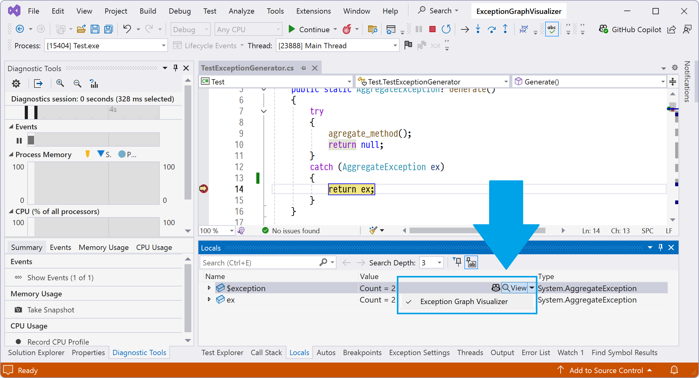

# ExceptionGraphVisualizer Visual Studio 2022 plugin
The plugin for Visual Studio 2022 that shows exceptions as a graph with all its inner exceptions and stack traces. 
Download the plugin from [Visual Studio Marketplace](https://marketplace.visualstudio.com/items?itemName=PolarGoose.ExceptionGraphVisualizer)

# How to use
The visualizer can be used during debugging 
 
After clicking on the `Exception Graph Visualizer` button, the plugin generates the PDF file and opens it using the default application. 
 
In addition, the plugin generated `*.dot` file with the GraphViz graph description that you can use to generate other image formats.

# Extra features
* The exception stack trace is demystified using [Ben.Demystifier](https://github.com/benaadams/Ben.Demystifier) 

# System requirements
* Windows x64
* Visual Studio 2022 17.0 or higher
* You need to have a default application associated with the `*.pdf` files.
